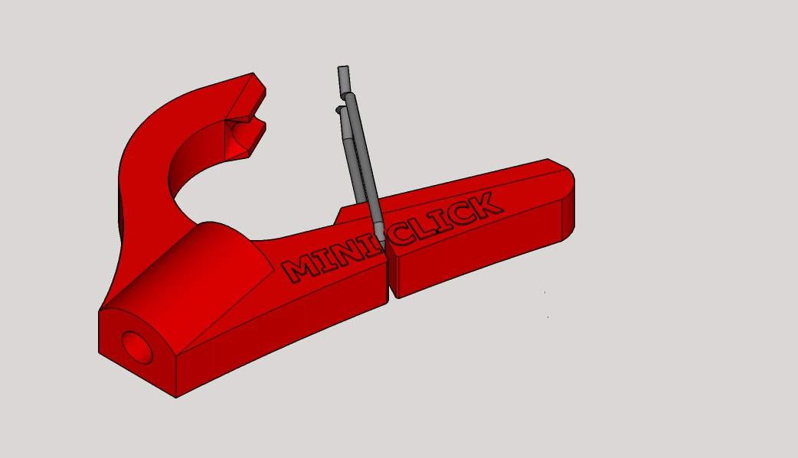
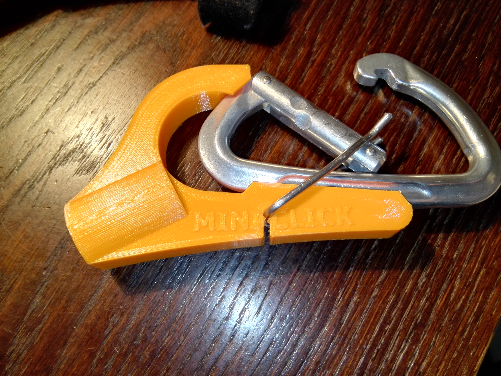

# Clipstick 

Hilfe für das Einhängen von Expressen. Der Clipstick ist mit einem 8 mm Loch vesehen. Darin kann eine M8 Gewindestange eingedreht werden. Diese wiederum pass auf zahlreiche Teleskopstöcke aus dem Malerzubehör.

Der Metallbügel ist ein 2 mm Federstahl. Ich habe einfach einen Metallkleiderbügel zerschnitten und verwendet.

## Design 

Designt mit Google SketchUp im www.erfindergarden.de 

